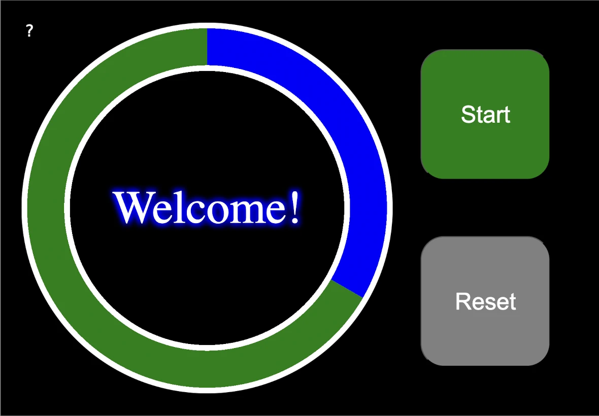
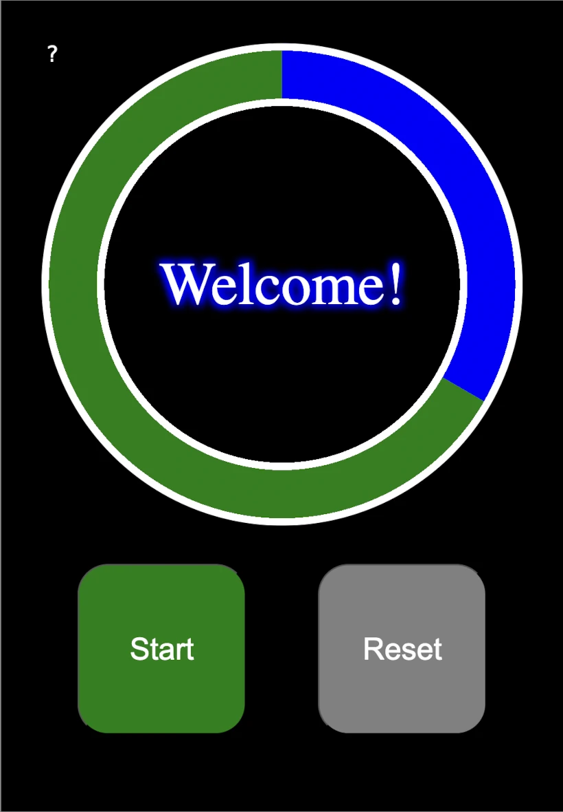
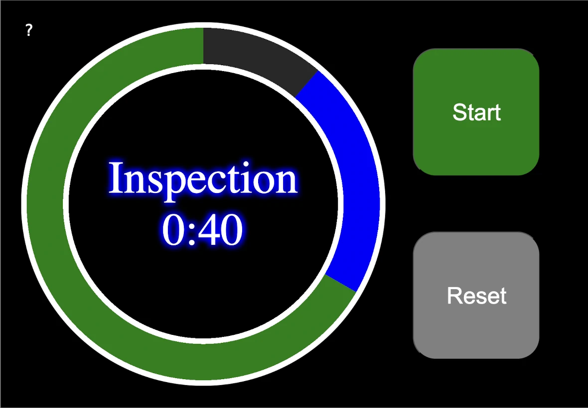
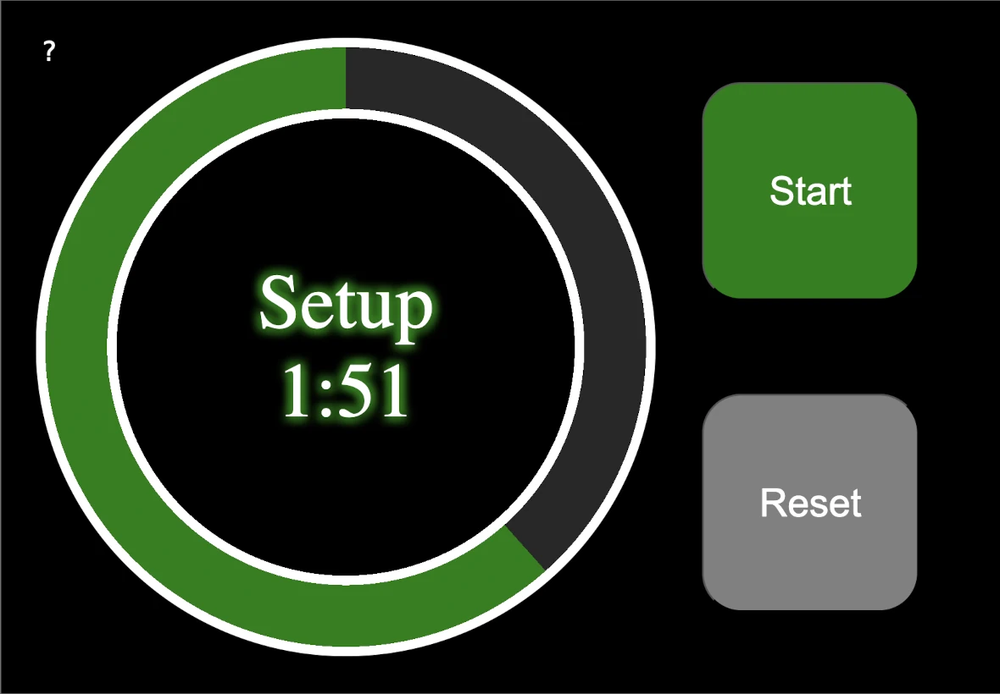
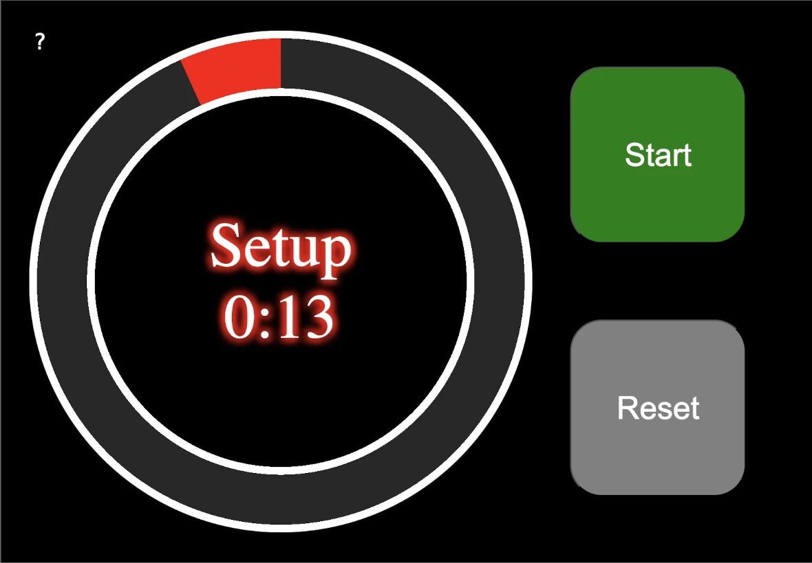
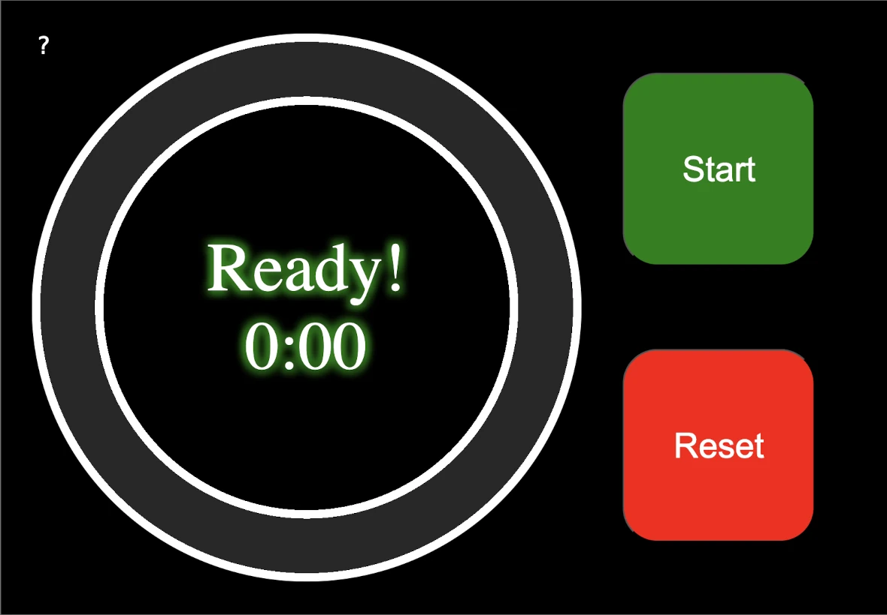
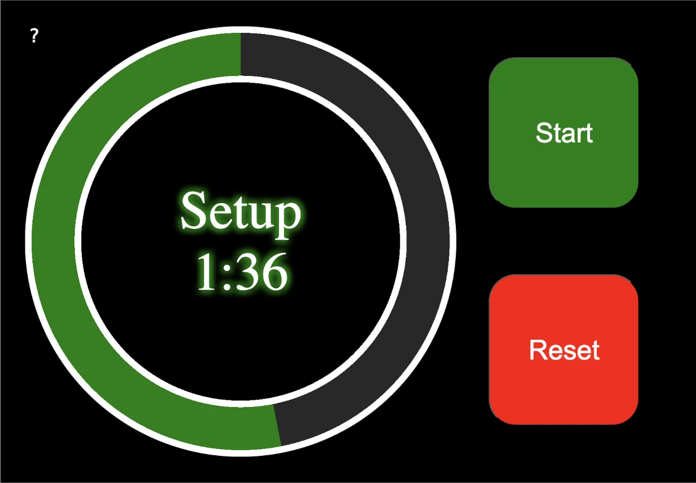
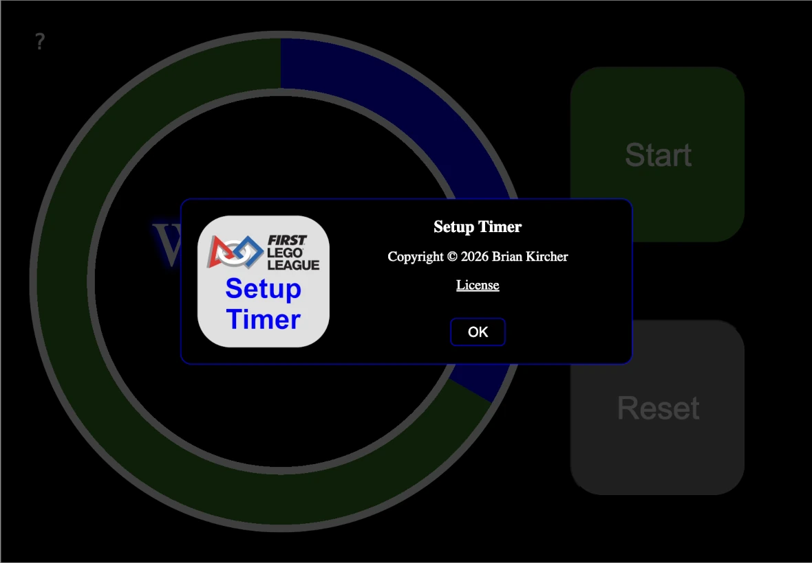

Copyright &copy; 2026 Brian Kircher

Open Source Software; you can modify and/or share it under the terms of BSD
license file in the root directory of this project.

# Overview

This project is a setup timer for the robot game of FIRST&reg; LEGO&reg; League
(FLL). It is used to keep track of providing the team with one minute to
complete inspection, then two minutes to complete setup for the start of the
match. The timer automatically transitions from the inspection time to the
setup time; teams that take less than a minute to complete inspection
effectively gets more time for setup, and teams that take more than a minute to
complete inspection get less time for setup.

The goal is to give teams a defined amount of time for these tasks, and ensure
that they are consistently and fairly applied to all teams. Plus, this helps
to ensure that the event does not get slowed down by a team that has "too much"
equipment by providing the head referee an easy tool to use to suggest starting
the match without them being ready (which typically results in that team being
_much_ faster when setting up for their next match).

This application is targeted at mobile devices, and is intended to be installed
as a progressive web app (PWA). Installation instructions are provided below.

At startup, the timer is ready to run:

  

The arrangement is slightly different if the display is in portrait mode:

  

It automatically adjusts between the two layouts as the orientation of the
device changes.

# Timing The Setup Before A Match

When ready to start the timer, press the *Start* button.  Time begins to count
down, through the one minute of Inspection:

  

After the minute of Inspection completes, the timer automatically transitions
to the two minutes of Setup time:

  

When the Setup time is nearly done, the color transitions from green to red as
a warning that the Setup time is nearly expired:

  

When the time expires, it shows that time has expired by showing that the team
is ready (whether or not they are actually ready!):

  

At this point, pressing the *Start* button restarts the timer (for the next
team), or pressing the *Reset* button resets the timer in preparation for the
next team. From a procedural perspective, the timer should not be reset until
after the match has completed (so that the timer continues to show that the
team has had their inspection/setup time); though the actual procedure should
be set by the head referee.

# Resetting The Timer While It Is Running

When the timer is running, pressing the *Reset* button turns it red, activating
it so that it can reset the timer:

  

After one second, it automatically turns gray again and is deactivated. If it
is pressed while it is still red, the timer is reset.  Requiring two presses of
the *Reset* button makes it less likely that the timer gets accidentally reset.

# About

Pressing the _?_ button in the upper left corner of the screen brings up the
About dialog:

  

If using the application from a mobile device, and it has not been installed
locally, there is an additional link on the About dialog that provides
installation instructions for the mobile platform that is being used. Those
instructions are also provided below.

# Installation

While the application can be used from the web browser, some advantages of
installing it on your device are:

* It can be quickly run via an icon on the home screen.

* It is fully cached on your device, so it is fully functional even if there
  is no network connection (as is the case in some school buildings).

* It is easier than trying to remembering an arcane URL!

Note that using a simple link on your home screen achieves most of these,
except for being able to run without a network connection.

## iOS

After navigating to the application's site in a web browser, do the following:

* Click on the share button (may be on the bottom of the browser window for
  iPhones and the upper right of the browser window for iPads).

* Scroll down and select "Add to Home Screen" from the menu that pops up.

* Select "Add" in the upper right to install this application to the home
  screen.

To remove the application, a long press on the home screen icon brings up the
application menu; select "Delete Bookmark" (in red) to start the process.

## Android

After navigating to the application's site in a web browser, do the following:

* Click on the three vertical dots in the upper right corner of the browser.

* Select "Add to Home screen" from the menu that pops up.

* Select "Install" to install this application (as opposed to adding a browser
  shortcut).

* Select "Install" to confirm that you'd like to install the application.

* Select "Add to Home screen" to finalize installing the application to the
  home screen.

To remove the application:

* Go to "Settings"

* Select "Apps"

* Select "See all apps"

* Select "Setup Timer"

* Select "Uninstall"

# Trademarks

FIRST&reg; is a trademark of For Inspiration and Recognition of Science and
Technology (FIRST), which does not sponsor, authorize, or endorse this
application.

LEGO&reg; is a trademark of the LEGO Group of companies, which does not
sponsor, authorize, or endorse this application.